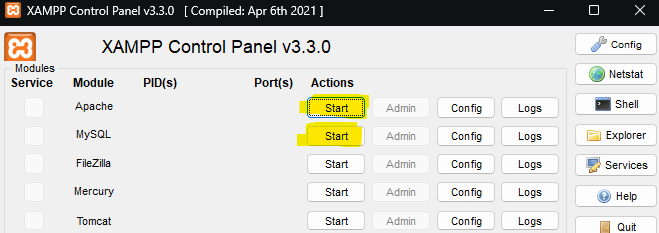
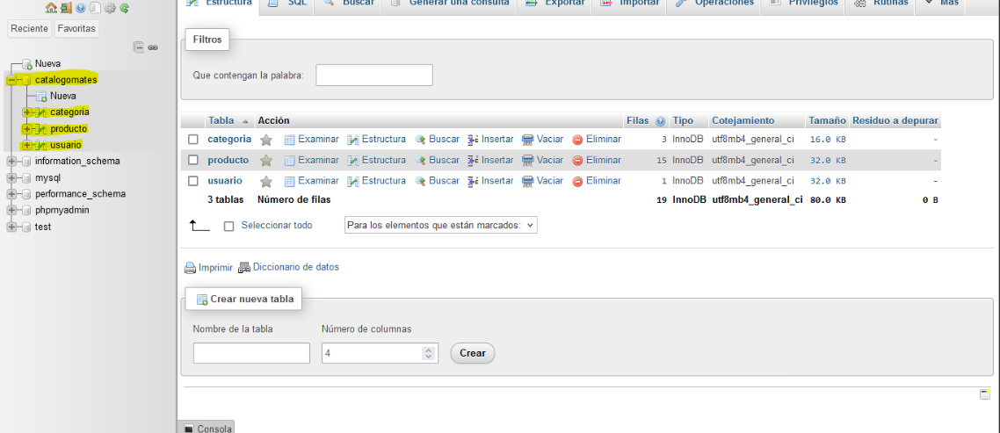

# TPE 2024 - Primera parte - Dominio

---

# INTEGRANTES: Ricco Pablo , Slavich Tomás

## Tema del trabajo: CATALOGO DE MATES

## Tablas:

Nuestras tablas estan planteadas en una relacion 1 a N (Un **"PRODUCTO"** puede pertenecer a UNA sola categoria mientras que una **"CATEGORIA"** puede contener VARIOS productos).

**Categoria**

**`id_categoria`**: muestra un id UNICO para cada categoria.

**`material_fabricacion`**: determina de que material esta fabricado el mate (en este caso **Calabaza**, **Madera** , **Vidrio**)

**`descripcion`**: muestra una breve descripcion del mate segun su material de fabricacion.

**`requiere_curado`**: determina si el mate requiere o no de un curado previo.

**Producto**

**`id_mate`**: muestra un id UNICO para cada mate.

**`forma_mate`**: determina que tipo de mate se pide (ya sea **Imperial**, **Torpedo**, **Camionero**).

**`imagen`**: imagen representativa del mate.

**`recubrimiento_mate`**: tipo de recubrimiento del mate (cuero natural o sintetico).

**`id_categoria_fk`**: clave foranea la cual relaciona la tabla de producto con categoria.

---

**Diagrama**

# TPE 2024 - Segunda parte

**Datos para la cuenta de administrador**

**`Usuario`**: webadmin

**`Password`**: admin

**Pasos para desplegar la db**

**Requisitos**

Se debe tener instalado XAMPP.

**Pasos a seguir para importar la db**

**`1`** Abrimos XAMPP.

**`2`** Iniciamos **Apache** y **MySQL** presionando el boton **"Start"**.

**`3`** Con **Apache** y **MySQL** ya levantados nos dirigimos a la siguiente URL **`localhost/phpmyadmin`**.

**`4`** Creamos una base de datos vacia con el nombre **catalogomates** e importamos nuestro archivo **`catalogomates.sql`**.

Realizando estos pasos ya tendremos nuestra base de datos importada y completamente funcional.

